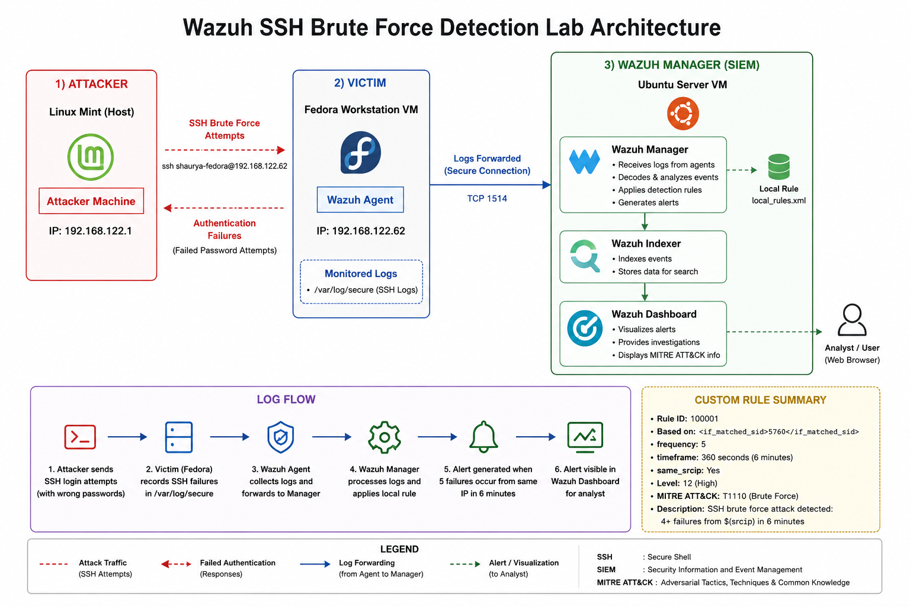
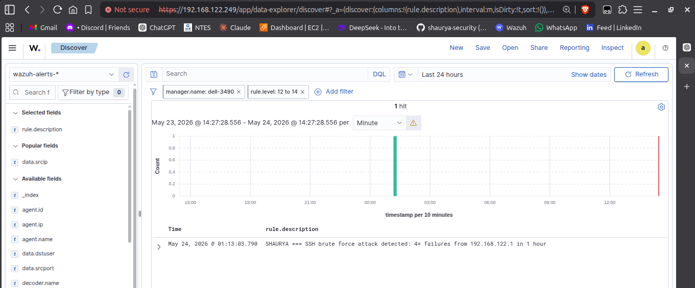
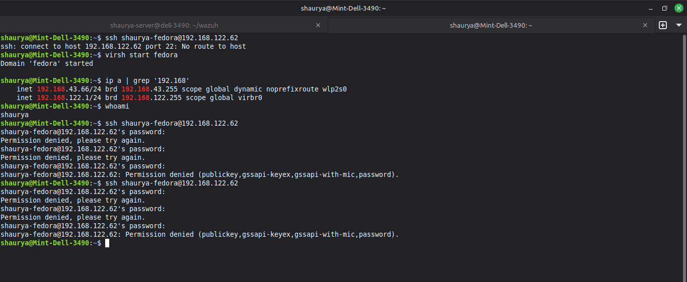
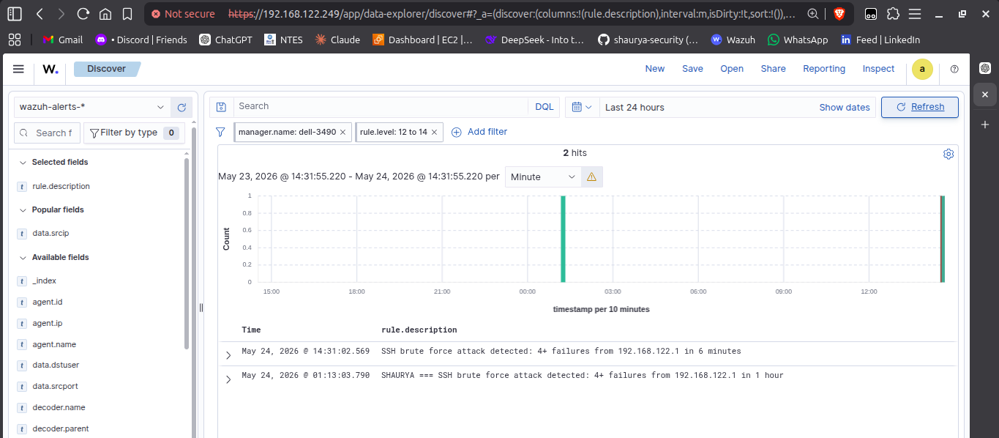
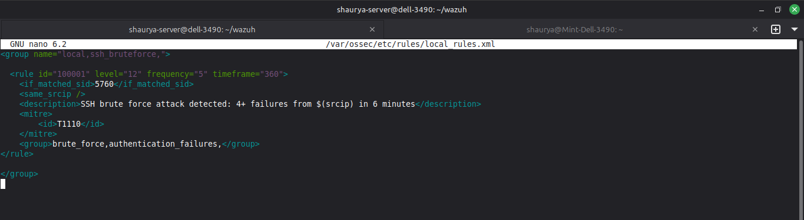

# Wazuh SSH Brute Force Detection Lab

Simulated an SSH brute force attack on a local KVM-based lab and detected it using a custom Wazuh rule. The alert fired correctly, mapped to MITRE T1110, and logged the attack chain with full context.

---

## Lab Environment

| Role | Machine |
|------|---------|
| Attacker + Host | Linux Mint (bare metal) |
| Victim + Agent | Fedora Workstation (KVM VM) |
| Wazuh SIEM | Ubuntu Server (KVM VM) |

The Mint host ran both the attack simulation and the Wazuh dashboard browser session. The Fedora VM was the target, running the Wazuh agent and forwarding its SSH logs to the manager on Ubuntu Server.

---

## Architecture



---

## What Was Done

**1. Verified the Wazuh stack was running on Ubuntu Server**
```bash
sudo systemctl status wazuh-manager wazuh-indexer wazuh-dashboard --no-pager
```
All three active before proceeding.

**2. Wrote and deployed a custom detection rule**

Added to `/var/ossec/etc/rules/local_rules.xml`:

```xml
<group name="local,ssh_bruteforce,">
  <rule id="100001" level="12" frequency="5" timeframe="360">
    <if_matched_sid>5760</if_matched_sid>
    <same_srcip />
    <description>SSH brute force attack detected: 4+ failures from $(srcip) in 6 minutes</description>
    <mitre>
        <id>T1110</id>
    </mitre>
    <group>brute_force,authentication_failures,</group>
  </rule>
</group>
```

Rule logic: fires when 5 or more events matching SID 5760 (SSH authentication failure) come from the same source IP within a 6-minute window. SID 5760 is Wazuh's base rule for SSH failed password attempts.

**3. Restarted the Wazuh manager to load the rule**
```bash
sudo systemctl restart wazuh-manager
```

**4. Checked the dashboard baseline before the attack**

Confirmed no active alerts for the target machine.



**5. Ran the simulated brute force from Linux Mint against the Fedora VM**

Manually failed SSH authentication 6 times in quick succession:
```bash
ssh shaurya-fedora@192.168.122.62
# wrong password × 6
```



**6. Verified the alert fired in the Wazuh dashboard**

Rule 100001 triggered. Alert visible with correct metadata.




---

## Alert Output

Full JSON from the Wazuh index: [`alerts/ssh-bruteforce-alert.json`](alerts/ssh-bruteforce-alert.json)

Key fields:

| Field | Value |
|-------|-------|
| `rule.id` | 100001 |
| `rule.level` | 12 |
| `rule.description` | SSH brute force attack detected: 4+ failures from 192.168.122.1 in 6 minutes |
| `rule.mitre.id` | T1110 |
| `rule.mitre.tactic` | Credential Access |
| `data.srcip` | 192.168.122.1 (Linux Mint host) |
| `data.dstuser` | shaurya-fedora |
| `agent.name` | Fedora-desktop |
| `agent.ip` | 192.168.122.62 |
| `manager.name` | dell-3490 |
| `timestamp` | 2026-05-24T09:01:02.569Z |

The `previous_output` field in the alert contains the 4 preceding failed login lines that triggered the rule — showing the full attack chain, not just the final event.

---

## Custom Rule — Explained

```xml
<rule id="100001" level="12" frequency="5" timeframe="360">
```

- `id="100001"` — custom rules start at 100000 to avoid colliding with Wazuh's built-in rule IDs
- `level="12"` — high severity (Wazuh scale: 0–15)
- `frequency="5"` — rule fires after 5 matching events
- `timeframe="360"` — within a 360-second (6-minute) window

```xml
<if_matched_sid>5760</if_matched_sid>
```
Watches for events already matched by SID 5760 — Wazuh's base rule for SSH failed password. This rule stacks on top of it rather than trying to re-parse the raw log.

```xml
<same_srcip />
```
The 5 failures must come from the same source IP. Without this, failures from different IPs could accumulate and trigger the rule incorrectly.

---

## Detection Result

The alert fired after 5 failed attempts from `192.168.122.1` against `shaurya-fedora` on the Fedora VM. Rule frequency was set to 5 — so the 6th attempt within the timeframe was the trigger.

This is a true positive in a controlled lab context. In a real environment, the triage question would be: is `192.168.122.1` a known internal machine, and is this volume of failures consistent with an admin typo or a scripted attack?

---

## Investigation Report

Full report: [`investigation_report/investigation_report.md`](investigation_report/investigation_report.md)

**Alert triage summary:**

| Field | Value |
|-------|-------|
| Source IP | 192.168.122.1 (Linux Mint host) |
| Target | shaurya-fedora @ 192.168.122.62 |
| Time window | 6 minutes |
| Total failures | 6 |

**Hypothesis:** Internal machine compromised or misconfigured automation.

**Next steps (real-world response):**
- Isolate the source IP via firewall rule
- Examine the source machine for malware or unauthorized scripts
- Enforce key-based authentication, disable password auth on SSH

---

## Files

```
wazuh-ssh-bruteforce-detection/
├── alerts/
│   └── ssh-bruteforce-alert.json          full alert JSON from Wazuh index
├── architecture/
│   └── lab-diagram.png                    network diagram of the lab setup
├── images/
│   ├── dashboard-before.png               dashboard state before the attack
│   ├── dashboard-after.png                alert visible after attack simulation
│   ├── local-rule.png                     rule as deployed in the dashboard
│   └── ssh-attack.png                     terminal showing the brute force attempts
├── investigation_report/
│   └── investigation_report.md            triage summary and real-world response steps
├── rules/
│   └── local_rules.xml                    the custom detection rule
└── README.md
```
